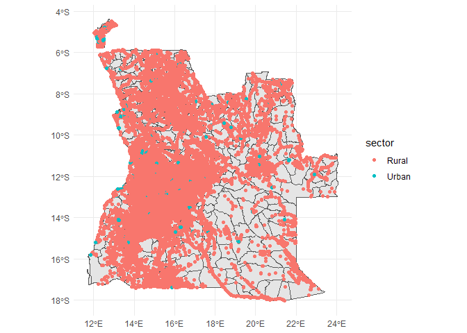

<!-- README.md is generated from README.Rmd. Please edit that file -->

# Measuring Market Access of the Villages in Angola

- Introduction

- The Data

Combining administrative data with geospatial data from open street
maps. Describe the data Show plots of the road network, location of the
villages and the location of the markets and ATMs within the country

- Results

