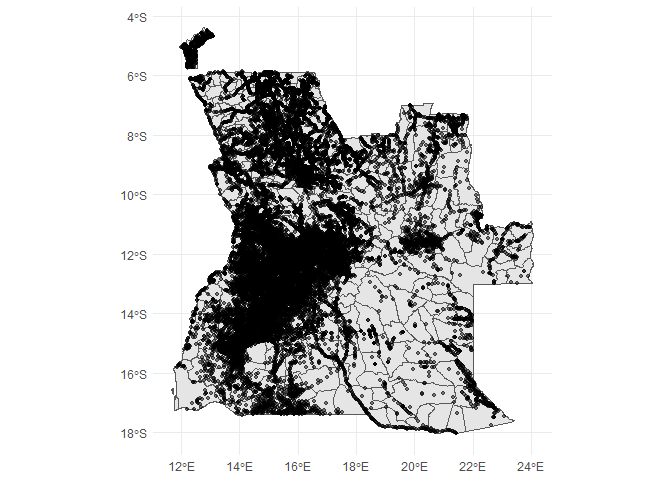
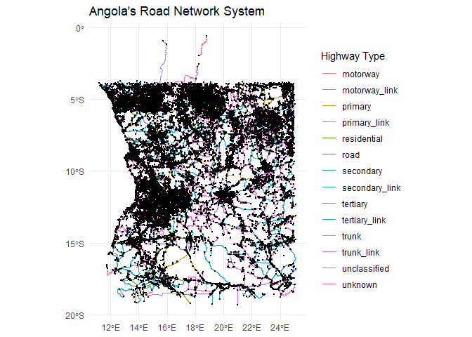
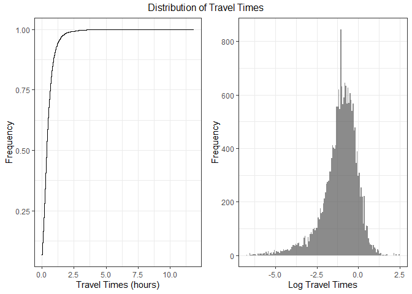

<!-- README.md is generated from README.Rmd. Please edit that file -->

# Measuring Market Access of the Villages in Angola

### Introduction

An important goal of development in areas of transportation and land use
policy is improving the accessibility of the poor to basic services.
Angola is a country with 35.9 million people spread over a vast area of
nearly half a million square kilometers. The country is one of the
largest within the continent and a significant proportion of its people
live in remote areas. In addition, the transportation infrastructure
within the country which makes reaching those in need to provide access
to services remains a development challenge. Consequently, a significant
proportion of rural communities have no markets or financial services
which makes participation in the economy more difficult particularly for
the poor.

In this study, we apply data from open street maps (OSM) on the
available road infrastructure and the locations of all markets and
financial services within Angola. We use this to measure the expected
travel times from each village community within the country to markets
and financial services. This allows us to answer the following
questions:

- What is the spatial distribution of markets and financial services
  within the country?
- What is the spatial allocation of roads within the country?
- How accessible is each village community from their nearest
  market/financial service?

### The Methodology & Data

In measuring the expected length of time it takes each village community
to arrive at the nearest market or financial service, we combine the
community geolocation data from the 2018 census with the road network
map and the location of all markets and financial services within the
country. Specifically, we apply the following steps:

1)  We obtain and clean the community geolocated data to ensure each
    location is within the country and remove all incorrectly geocoded
    communities.

The locations of the 23088 geolocated communities spread across the
country as follow:

    #> Reading layer `Angola_Settlement_Extents_Version_02' from data source 
    #>   `C:\Users\wb559885\OneDrive - WBG\Documents\GitProjects\AngolaAccessibility\data-raw\settlements' 
    #>   using driver `ESRI Shapefile'
    #> Simple feature collection with 483967 features and 16 fields
    #> Geometry type: MULTIPOLYGON
    #> Dimension:     XY
    #> Bounding box:  xmin: 11.71346 ymin: -18.02722 xmax: 24.01662 ymax: -4.406436
    #> Geodetic CRS:  WGS 84
    #> although coordinates are longitude/latitude, st_intersects assumes that they
    #> are planar
    #> although coordinates are longitude/latitude, st_intersects assumes that they
    #> are planar

2)  We create a query box within which the locations of all markets,
    ATMs and Banks as well as the road network map will be return from
    the Open Street Map server. The query box is based on the geospatial
    extent of the country i.e. the maximum and minimum coordinate values
    intersecting the country in a square shape. Angola shares a border
    with Zambia to the East, Namibia to the South and the Democratic
    Republic of Congo (DRC) to the North. Like many other countries,
    individuals and families living close to the border in Angola are
    able to skip across to satisfy their needs without recourse to any
    disallowing border policies. Consequently, we add an additional 50km
    (upon expert advice) to the border to query box previous described
    to account for access to services in the neighboring countries.

We apply an OSM database GET query to extract locations of all markets,
ATMs and Banks within Angola based on the aforementioned query
paremeters. There are 1156 geolocations returned from the GET request.

Note: The map shows community locations (in blue) and markets-financial
services (in red)

3)  Likewise, we use the same query system to extract the road network
    system data within the country. We filter for the lines or
    multi-lines data with the following classifications: “motorway”,
    “primary”, “secondary”, “tertiary”, “unclassified”, “residential”,
    “trunk”, “road”, “motorway_link”,“trunk_link”, “primary_link”,
    “secondary_link”, “tertiary_link”. We apply a cleaning process to
    the road network lines data performing the following operations:

- Due to a large number of missing speed limits within the road segment
  data, we create a speed dictionary assigning an expected speed to each
  type of road. We apply adjustments for the surface quality of each
  road.

$$v_{rtq} = E(v_t)*\lambda_s$$

where $E(v_t)$ represents the speed for each road type and $\lambda_s$
is the adjustment factor for the surface types i.e. surfaces that are
rougher and make roads less suited for traffic should reduce $v$ for a
road $r$. We can now compute travel times for each road segment, $r$, as
follows:

$$\pi_{r} = \frac{D_{r}} {v_{rtq}}$$

i.e. The length of a road (distance) $D_{r}$ is a product of travel time
$pi_{r}$ and the expected speed of travel $v_{rtq}$.

- We make structural adjustments to the road geometries obtained from
  OSM to create a more realistic picture. These changes include deleting
  redundant edges and loops, assuming all roads to be bi-directional and
  we snap edges i.e. any two road edges ends within 30m of each other
  are snapped into one road. This is because OSM roads are often
  inputted manually and two roads that form a junction might not be
  properly mapped living a space between two edges. Leaving this
  unconnected, creates origins and destinations that seem unconnected or
  increase the expected distance/time to destination.

4)  Next, we blend origins (community locations), road network and
    destinations (markets and financial services). This allows us to
    create origin-destination cost matrices i.e. estimate the travel
    times from each community location to all destinations. Select, the
    minimum travel time for each community location as the expected
    travel time for each community to their nearest destination.

### Estimation Results

Below is a map of the spatial distribution of access to markets and
financial services within the country.

This analysis contains two major flaws. Firstly, our travel times assume
that all households have an equal means of transport. While flawed, this
has the advantage of allowing us to focus on how long it would take a
household to arrive at its nearest market or financial service of
interest while keeping all other factors constant. Finally (and perhaps
more importantly), the open street maps database can be incomplete in
remote areas.

### Appendix

#### Speed Dictionary

<table class="table" style="color: black; width: auto !important; margin-left: auto; margin-right: auto;">
<thead>
<tr>
<th style="text-align:left;">
Highway Type
</th>
<th style="text-align:right;">
(%) by Type
</th>
<th style="text-align:right;">
Speed (km/hr)
</th>
</tr>
</thead>
<tbody>
<tr>
<td style="text-align:left;">
motorway
</td>
<td style="text-align:right;">
0.116
</td>
<td style="text-align:right;">
90
</td>
</tr>
<tr>
<td style="text-align:left;">
motorway_link
</td>
<td style="text-align:right;">
0.027
</td>
<td style="text-align:right;">
60
</td>
</tr>
<tr>
<td style="text-align:left;">
primary
</td>
<td style="text-align:right;">
1.415
</td>
<td style="text-align:right;">
70
</td>
</tr>
<tr>
<td style="text-align:left;">
primary_link
</td>
<td style="text-align:right;">
0.150
</td>
<td style="text-align:right;">
50
</td>
</tr>
<tr>
<td style="text-align:left;">
residential
</td>
<td style="text-align:right;">
76.464
</td>
<td style="text-align:right;">
50
</td>
</tr>
<tr>
<td style="text-align:left;">
road
</td>
<td style="text-align:right;">
0.216
</td>
<td style="text-align:right;">
70
</td>
</tr>
<tr>
<td style="text-align:left;">
secondary
</td>
<td style="text-align:right;">
1.381
</td>
<td style="text-align:right;">
60
</td>
</tr>
<tr>
<td style="text-align:left;">
secondary_link
</td>
<td style="text-align:right;">
0.089
</td>
<td style="text-align:right;">
80
</td>
</tr>
<tr>
<td style="text-align:left;">
tertiary
</td>
<td style="text-align:right;">
2.919
</td>
<td style="text-align:right;">
55
</td>
</tr>
<tr>
<td style="text-align:left;">
tertiary_link
</td>
<td style="text-align:right;">
0.115
</td>
<td style="text-align:right;">
90
</td>
</tr>
<tr>
<td style="text-align:left;">
trunk
</td>
<td style="text-align:right;">
0.819
</td>
<td style="text-align:right;">
55
</td>
</tr>
<tr>
<td style="text-align:left;">
trunk_link
</td>
<td style="text-align:right;">
0.079
</td>
<td style="text-align:right;">
45
</td>
</tr>
<tr>
<td style="text-align:left;">
unclassified
</td>
<td style="text-align:right;">
16.206
</td>
<td style="text-align:right;">
40
</td>
</tr>
<tr>
<td style="text-align:left;">
unknown
</td>
<td style="text-align:right;">
0.003
</td>
<td style="text-align:right;">
50
</td>
</tr>
</tbody>
</table>

#### Road Surface Adjustments

<table class="table" style="color: black; width: auto !important; margin-left: auto; margin-right: auto;">
<thead>
<tr>
<th style="text-align:left;">
surface type
</th>
<th style="text-align:right;">
adjustment factor
</th>
</tr>
</thead>
<tbody>
<tr>
<td style="text-align:left;">
asphalt
</td>
<td style="text-align:right;">
1.00
</td>
</tr>
<tr>
<td style="text-align:left;">
pavement
</td>
<td style="text-align:right;">
0.77
</td>
</tr>
<tr>
<td style="text-align:left;">
concrete
</td>
<td style="text-align:right;">
0.91
</td>
</tr>
<tr>
<td style="text-align:left;">
concrete:plates
</td>
<td style="text-align:right;">
0.91
</td>
</tr>
<tr>
<td style="text-align:left;">
compacted
</td>
<td style="text-align:right;">
0.91
</td>
</tr>
<tr>
<td style="text-align:left;">
dirt
</td>
<td style="text-align:right;">
0.77
</td>
</tr>
<tr>
<td style="text-align:left;">
unpaved
</td>
<td style="text-align:right;">
0.77
</td>
</tr>
<tr>
<td style="text-align:left;">
ground
</td>
<td style="text-align:right;">
0.77
</td>
</tr>
<tr>
<td style="text-align:left;">
cobblestone
</td>
<td style="text-align:right;">
0.77
</td>
</tr>
<tr>
<td style="text-align:left;">
sand
</td>
<td style="text-align:right;">
0.77
</td>
</tr>
<tr>
<td style="text-align:left;">
mud
</td>
<td style="text-align:right;">
0.77
</td>
</tr>
<tr>
<td style="text-align:left;">
gravel
</td>
<td style="text-align:right;">
0.77
</td>
</tr>
<tr>
<td style="text-align:left;">
pebblestone
</td>
<td style="text-align:right;">
0.77
</td>
</tr>
<tr>
<td style="text-align:left;">
paving_stones
</td>
<td style="text-align:right;">
0.77
</td>
</tr>
<tr>
<td style="text-align:left;">
wood
</td>
<td style="text-align:right;">
0.77
</td>
</tr>
<tr>
<td style="text-align:left;">
metal
</td>
<td style="text-align:right;">
0.77
</td>
</tr>
<tr>
<td style="text-align:left;">
fine_gravel
</td>
<td style="text-align:right;">
0.77
</td>
</tr>
<tr>
<td style="text-align:left;">
grass
</td>
<td style="text-align:right;">
0.77
</td>
</tr>
<tr>
<td style="text-align:left;">
unpaved:ground
</td>
<td style="text-align:right;">
0.77
</td>
</tr>
<tr>
<td style="text-align:left;">
rock
</td>
<td style="text-align:right;">
0.77
</td>
</tr>
<tr>
<td style="text-align:left;">
groundRzeka capungo
</td>
<td style="text-align:right;">
0.67
</td>
</tr>
<tr>
<td style="text-align:left;">
unhewn cobblestone
</td>
<td style="text-align:right;">
0.77
</td>
</tr>
<tr>
<td style="text-align:left;">
unknown
</td>
<td style="text-align:right;">
1.00
</td>
</tr>
</tbody>
</table>
